# ATM LLD

> Requirements

- Has card reader
- Interface for entry pin (physical / digital)
- Cash dispense → Minimize carry notes
- Print (prints details of transactions)
- Mini statement
- Change pin
- Extensible to all banks
- Deposit (deposit slot)

> UML Diagram

```mermaid
classDiagram
%%======================
%% Context & State Pattern
%%======================
class ATM {
  -currentState : ATMState
  -cardReader : CardReader
  -pinEntry : IPinEntry
  -display : Display
  -printer : Printer
  -cashDispenser : CashDispenser
  -depositSlot : DepositSlot
  -bankConnector : IBankConnector
  -txnFactory : TransactionFactory
  +setState(state : ATMState)
  +insertCard(card)
  +enterPin(pin)
  +selectTransaction(type, params)
  +performTransaction(txnType, params)
  +dispenseCash(amount)
  +ejectCard()
  +shutdown()
}

class ATMState {
  +insertCard(card)
  +enterPin(pin)
  +selectTransaction(type, params)
  +performTransaction(txnType, params)
  +dispenseCash(amount)
  +ejectCard()
}

class IdleState
class CardInsertedState
class AuthenticatedState
class ProcessingState
class OutOfServiceState

ATMState <|.. IdleState
ATMState <|.. CardInsertedState
ATMState <|.. AuthenticatedState
ATMState <|.. ProcessingState
ATMState <|.. OutOfServiceState
ATM o-- ATMState : currentState

%%======================
%% Hardware Components
%%======================
class CardReader {
  +readCard() : Card
  +ejectCard()
  +retainCard()
}

class IPinEntry {
  +capturePin() : EncryptedPin
}

class PhysicalPinPad {
  +capturePin()
}
class OnScreenPinEntry {
  +capturePin()
}
IPinEntry <|.. PhysicalPinPad
IPinEntry <|.. OnScreenPinEntry

class Display {
  +show(message)
  +showMenu(menu)
  +showMiniStatement(records)
}

class Printer {
  +print(text)
  +printReceipt(txn)
}

class CashDispenser {
  -inventory : Map<int,int>
  -strategy : INoteDispenserStrategy
  +dispense(amount)
  +loadNotes(denom, count)
  +setStrategy(strategy)
}

class INoteDispenserStrategy {
  +computeNotes(amount, inventory)
}

class GreedyNoteStrategy {
  +computeNotes(amount, inventory)
}
class MinNotesStrategy {
  +computeNotes(amount, inventory)
}
INoteDispenserStrategy <|.. GreedyNoteStrategy
INoteDispenserStrategy <|.. MinNotesStrategy

class DepositSlot {
  +acceptCashBundle(bundle)
  +acceptCheque(cheque)
  +validateBundle(bundle)
}

ATM o-- CardReader
ATM o-- IPinEntry
ATM o-- Display
ATM o-- Printer
ATM o-- CashDispenser
ATM o-- DepositSlot
CashDispenser o-- INoteDispenserStrategy

%%======================
%% Bank Connector (Adapter)
%%======================
class IBankConnector {
  +authorize(cardNumber, pin, amount)
  +postTransaction(txn)
  +getMiniStatement(accountId, count)
  +changePin(accountId, oldPin, newPin)
  +deposit(accountId, depositDetails)
}

class HDFCConnector {
  +authorize(cardNumber, pin, amount)
  +postTransaction(txn)
  +getMiniStatement(accountId, count)
  +changePin(accountId, oldPin, newPin)
  +deposit(accountId, depositDetails)
}
IBankConnector <|.. HDFCConnector
ATM o-- IBankConnector

%%======================
%% Transaction Hierarchy
%%======================
class Transaction {
  -id : UUID
  -accountId : String
  -amount : int
  -timestamp : DateTime
  +execute(bank : IBankConnector)
  +validate()
}

class Withdrawal {
  +execute(bank)
}
class DepositTxn {
  +execute(bank)
}
class MiniStatementTxn {
  +execute(bank)
}
class ChangePinTxn {
  +execute(bank)
}

Transaction <|-- Withdrawal
Transaction <|-- DepositTxn
Transaction <|-- MiniStatementTxn
Transaction <|-- ChangePinTxn

class TransactionFactory {
  +create(txnType : String, params : Map) : Transaction
}
ATM o-- TransactionFactory
Transaction --> IBankConnector

%%======================
%% Value Objects
%%======================
class Card {
  -cardNumber : String
  -cardHolder : String
  -expiry : Date
}
class AuthorizationResult
class TransactionResult
class TransactionRecord
class ValidationResult
class DispenseResult
class DepositResult

ATM --> Card

```

